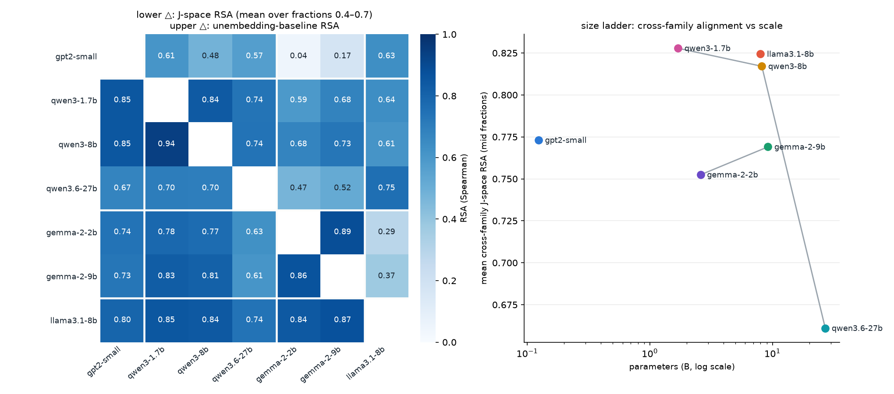
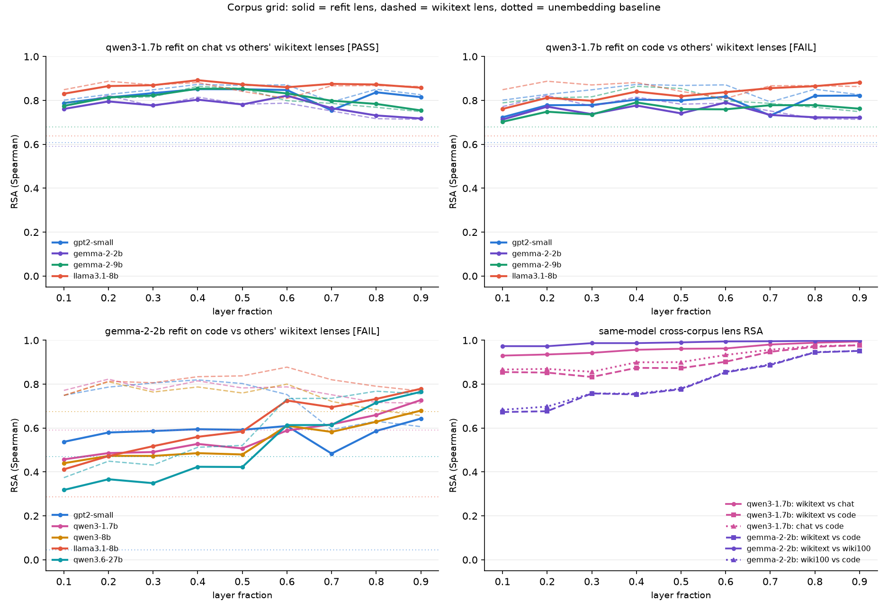

# Universality at scale: 7-model grid + corpus grid

Scales the cross-model J-space universality result (`../universality/`) from 3
to 7 models (4 families, 0.124B–27B) and grows the corpus-robustness grid
(`../corpus-refit/`) by two cells (qwen3-1.7b x chat, gemma-2-2b x code) plus a
fit-noise control. Part 1 is CPU/network-only; the Part 2 lens fits are the
only GPU-heavy step (measured on a single MI300X).

## Part 1 — 7x7 universality grid (`extend_a.py`)

- Models: gpt2-small, qwen3-1.7b, qwen3-8b, qwen3.6-27b, gemma-2-2b,
  gemma-2-9b, llama3.1-8b. Pre-fitted wikitext lenses from
  `neuronpedia/jacobian-lens` (revisions pinned in `config.yaml`; the 27B lens
  is the `_n1000` variant on the `qwen-n1000` branch).
- No full model downloads: tokenizers + unembedding/final-norm tensors fetched
  shard-wise via the safetensors index (the 27B needed only 2 of 15 shards; its
  text tower lives under `model.language_model.*` and its unembedding is the
  untied `lm_head.weight`).
- Convention: norm-scaled readout (the primary convention validated in
  `../universality/`; gemma uses 1+w). Baselines: unembedding RSA (both norm
  conventions) + shuffled labels x3. The J-space `raw` variant and SVCCA were
  dropped at this scale (the 3-model run showed raw collapses for qwen and
  SVCCA separates nothing); the random-orthogonal baseline equals the unembed
  baseline by construction and was dropped too.
- Concepts: **507 shared single-token concepts across ALL 7 tokenizers** — the
  same count as the 3-model run; the pool (559) is the bottleneck, not the new
  tokenizers (per-model single-token counts 515–559). 507 >= 200, so
  pairwise-maximal sets were not needed (their sizes are recorded in
  `metrics_extend_a.json` under `pairs_pairwise_max`).

### The 7x7 matrix (mean J-space RSA over fractions 0.4–0.7, lower triangle; unembedding baseline, upper triangle)



|  | gpt2 | q1.7 | q8 | q27 | g2 | g9 | l8 |
|---|---|---|---|---|---|---|---|
| **gpt2-small** | — | .61 | .48 | .57 | .04 | .17 | .63 |
| **qwen3-1.7b** | .85 | — | .84 | .74 | .59 | .68 | .64 |
| **qwen3-8b** | .85 | .94 | — | .74 | .68 | .73 | .61 |
| **qwen3.6-27b** | .67 | .70 | .70 | — | .47 | .52 | .75 |
| **gemma-2-2b** | .74 | .78 | .77 | .63 | — | .89 | .29 |
| **gemma-2-9b** | .73 | .83 | .81 | .61 | .86 | — | .37 |
| **llama3.1-8b** | .80 | .85 | .84 | .74 | .84 | .87 | — |

### Findings

1. **Cross-family universality scales.** Excluding the 27B (see 3), all 13
   cross-family pairs sit at mid-fraction RSA 0.73–0.88 (mean 0.79) and 12/13
   pass the original pre-registered criterion (margin over unembed > shuffled
   spread at every mid fraction); the one failure is marginal
   (qwen3-8b|gemma-2-9b @0.7: margin 0.028 vs spread 0.031). Sharpest cases
   remain the low-baseline pairs: gemma-2-2b|llama3.1-8b unembed 0.29 -> J
   0.84; gemma-2-9b|llama3.1-8b 0.37 -> 0.87; gpt2|gemma-2-2b 0.04 -> 0.74.
2. **Within-family pairs hit an unembedding ceiling.** gemma-2-2b|gemma-2-9b
   unembed RSA is 0.886 (shared tokenizer/embedding geometry), and J-space RSA
   (0.865) cannot beat it; same for the qwen|q27 pairs (unembed 0.74–0.76).
   The margin-over-unembed criterion is a *cross-family* test; within family
   the baseline itself is near ceiling. qwen3-1.7b|qwen3-8b still passes
   (J 0.94 vs unembed 0.84) — the highest cell in the matrix.
3. **The 27B anchor is NOT less universal — its band is shifted late.** At the
   fixed 0.4–0.7 window the 27B ranks last (mean 0.66 cross-family vs matrix
   mean 0.82). But its alignment profile rises sharply at fraction 0.6 and
   peaks at 0.8: late-band (0.6–0.8) means are 0.75–0.85 (mean 0.80) against
   every other model, beating its unembed baselines by 0.09–0.28. The
   convergence-story prediction ("biggest model aligns most") fails at matched
   *fraction* but survives at matched *band*: the 27B's verbalizable workspace
   simply sits deeper in relative depth (it has 64 layers; its lens covers
   0–62). Fraction-matching is the wrong alignment key at scale — future runs
   should band-match (align at each pair's argmax fraction) or report profiles.
4. **Size ladder: alignment does NOT increase with scale at mid fractions.**
   Mean cross-family mid RSA: gpt2 0.77, qwen1.7 0.83, qwen8 0.82,
   gemma2 0.75, gemma9 0.77, llama8 0.82, qwen27 0.66 (band-limited). Within
   ladders: qwen 1.7<->8 = 0.94; gemma 2<->9 = 0.86; the 1.7<->27 and 8<->27
   values (0.70) mix the band shift with a generation change (qwen3 vs
   qwen3.6), so they are not clean scale comparisons.
5. Headline stat unchanged in kind: J-space RSA far above shuffled floor
   (~0 +/- 0.03) everywhere, and above the unembedding baseline for every
   cross-family pair at its band.

Criterion bookkeeping: original pre-reg criterion 14/21 pairs overall (13/17
cross-family, 1/4 within-family); strict variant (vs best-of-both-conventions
unembed) 9/21 — the strict test was already knife-edge at fraction 0.7 in the
3-model run and is dominated here by the high-baseline pairs. All per-pair
details in `results/metrics_extend_a.json`.

## Part 2 — corpus grid (`fit_corpus.py`, `compare_corpus.py`)

Two new lenses fitted (100 prompts x 128 tokens, bf16, dim_batch 64,
checkpoint_every=2, sequential):

- **qwen3-1.7b x chat**: `HuggingFaceH4/ultrachat_200k` (train_sft), user
  turns only, concatenated per conversation, first-128-token full windows.
  (`lmsys/lmsys-chat-1m` was the first choice but is gated — 403, checked
  2026-07-21.)
- **gemma-2-2b x code**: `codeparrot/codeparrot-clean-valid` — the SAME code
  corpus as `../corpus-refit/`'s qwen refit, testing whether corpus-robustness
  generalizes across families.

Each refit lens is fitted at exactly the 9 layers `frac_to_layer` maps
fractions 0.1–0.9 onto (qwen: [3,6,8,11,14,17,20,22,25]; gemma:
[3,5,8,10,13,16,18,21,23]), then dropped into the same comparison against
the other 6 models' wikitext lenses on the same 507 concepts.

Pre-registered verdict rule (from `../corpus-refit/`): at every mid fraction,
|RSA_refit − RSA_wiki| <= 0.1 AND margin over unembed > max(0.1, shuffled
spread).

### Results

Fits: chat 994s, code 731s wall on MI300X (~8–10s/prompt at dim_batch 64,
under a co-running job); both converged (final max_d_mean ~0.03, matching
`../corpus-refit/`'s MPS code fit at n=100).

**Verdicts (cross-family rows, pre-registered rule):**

| refit lens | verdict | detail |
|---|---|---|
| qwen3-1.7b x chat | **PASS** | all 4 cross-family rows survive: max cross-family delta 0.051, margins over unembed +0.12 to +0.25 |
| qwen3-1.7b x code (`../corpus-refit/`'s lens, vs the 4-family grid) | **FAIL (knife-edge)** | 3/4 rows survive (max delta 0.069); the gemma-2-9b row misses only the new >0.1-margin bar (margins +0.080/+0.081/+0.099 at 0.5/0.6/0.7) while staying within tolerance (delta <= 0.094) and above the shuffled spread — the original rule (margin > spread) would pass it |
| gemma-2-2b x code | **FAIL (real)** | tolerance breaks in every row: deltas −0.11 to −0.30 at mid fractions; vs gpt2/llama the code lens still beats unembed by +0.27 to +0.57, but vs qwen partners the margin goes negative (their unembed baselines with gemma are 0.59–0.74) |

**Fit-noise control (`gemma-2-2b-wiki`).** Because the refits use n=100
prompts vs the ~460-prompt neuronpedia lenses, we fitted a third lens:
gemma-2-2b on **wikitext-103 itself** with the identical n=100 recipe. Result:
cross-model deltas vs the neuronpedia lens are <= 0.02 at every mid fraction
and same-model RSA is 0.987–0.996 — n=100 fit noise is negligible. (Its
formal verdict label is also "FAIL", but every failing cell is the
margin-over-unembed bar interacting with Part 1's known artifacts — the 27B
band shift and near-ceiling qwen/gemma baselines — with deltas ~0.01; the
tolerance half of the rule passes everywhere.) The gemma-code deviation is
therefore REAL corpus sensitivity, not convergence noise.

**Same-model cross-corpus lens RSA (mid fractions):** qwen3-1.7b
wikitext↔chat 0.96–0.98, wikitext↔code 0.87–0.95, chat↔code 0.90–0.96;
gemma-2-2b wikitext↔wiki100 **0.99** (control), wikitext↔code **0.75–0.89**
(rising with depth). Chat text perturbs the qwen lens *less* than code
(consistent with chat sitting closer to wikitext); gemma's J-space geometry
is ~3x more corpus-sensitive than qwen's at matched n=100.

**Reading.** The corpus-robustness finding replicates and sharpens for
qwen — a second, maximally-different corpus (chat) moves cross-family RSA by
<= 0.05, and the code lens misses only the new stricter margin bar on one row
— but it does NOT generalize to gemma-2-2b at the 0.1 tolerance: the gemma
code lens keeps clear cross-family J-space alignment against low-baseline
partners (gpt2 +0.44..+0.57 over unembed, llama +0.27..+0.44 — it never
collapses to tokenizer geometry) yet its relational geometry shifts
−0.11..−0.30, cleanly outside tolerance and attributable to the corpus by the
control. Corpus-robustness of J-space geometry is family-dependent in
magnitude; gemma remains the outlier family of this project (wider ignition
transitions, over-driving, BOS sink). For the paper: state universality with
wikitext-matched lenses, cite qwen's corpus-invariance, and flag gemma's
corpus sensitivity as a boundary observation.



## Reproduce

```bash
# from the repo root, deps installed (see top-level README)
python universality-scaled/extend_a.py                            # Part 1, CPU/network, ~8 min
python universality-scaled/fit_corpus.py --fit qwen3-1.7b-chat    # ~17 min on an MI300X-class GPU
python universality-scaled/fit_corpus.py --fit gemma-2-2b-code    # ~12 min GPU
python universality-scaled/fit_corpus.py --fit gemma-2-2b-wiki    # ~12 min GPU (control)
python universality-scaled/compare_corpus.py                      # CPU, ~6 min
python universality-scaled/plots.py
```

Seeds: global 0, baseline seeds [0,1,2]. All model/lens revisions pinned in
`config.yaml`.

**Lens files are not shipped** (75–96 MB each; the repo's `.gitignore` excludes
`*.pt`). `fit_corpus.py` regenerates all three refit lenses deterministically
from the pinned model revisions, pinned layer lists, and cached prompt sets;
`compare_corpus.py` additionally expects the qwen code lens from
`../corpus-refit/` (regenerate it there with `fit_lens.py`, or re-fit here) at
`results/qwen3-1.7b_codeparrot_lens.pt`.

## Files

- `extend_a.py` — Part 1: 7x7 grid (shared concepts, RSA, baselines, criteria).
- `fit_corpus.py` — Part 2 lens fits (resumable, checkpointed).
- `compare_corpus.py` — Part 2 analysis (corpus-grid rows, verdicts, control).
- `plots.py` — `rsa_matrix.png`, `corpus_grid.png`.
- `config.yaml` — all model/lens/corpus pins, fractions, criteria.
- `results/` — `metrics_extend_a.json` (Part 1), `metrics_corpus_grid.json`
  (Part 2), `metrics.json` (combined pointer), figures. Fitted lenses,
  fit checkpoints, prompt caches, and fit logs are runtime artifacts, not
  shipped.
